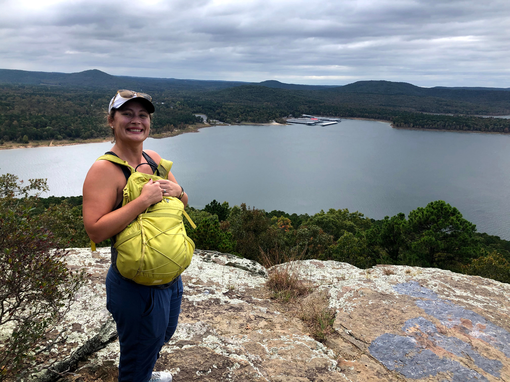

<style type="text/css">
h1.title {
  font-size: 38px;
  text-align: center;
}
body {
background-color: #B9F2FE
}
</style>  
<br>
<br>
<br>
  

```{r Stephanie, echo=FALSE, out.width= "55%", out.extra='style="float:right; background-color: #00637a; padding:18px;"'}

```  

### **Stephanie K. Archer, PI**  
I completed my PhD at North Carolina State University where I worked in the Layman Lab studying how sponges alter community composition and ecosystem function in tropical and subtropical nearshore marine ecosystems. I then moved on to work for Fisheries and Oceans Canada in multiple capacities. There I studied species interactions and ecosystem function of Glass Sponge Reefs and worked to develop efficient monitoring methods grounded in a strong understanding of the behavior and ecology of keystone species. I am now an Assistant Professor at LUMCON establishing a local research program focused on coastal Louisiana’s sponges, oyster reefs, and other biogenic habitats. Outside of work I have a healthy obsession with University of Georgia football (go Dawgs!), love to cook and read, and enjoy gardening, kayaking, and generally being outside.  
<br>
Twitter: @ArcherEcology

Email: sarcher at lumcon.edu

<a href="https://scholar.google.com/citations?user=pSv8vDwAAAAJ&hl=en">Google Scholar</a>
<br>
<a href="https://www.researchgate.net/profile/Stephanie_Archer3">Research Gate</a>
<br>
<br> 
<br>  

### **Philina English, Postdoctoral Fellow**  
<br>
<br> 
<br>  

### **Finella M. Campanino, Research Technician**  
<br>
```{r,echo=FALSE,message=FALSE}
slickR::slickR(
    list.files("images/Finella_slide/",full.names = TRUE,pattern = 'jpg'),
    height = 300)+slickR::settings(autoplay=TRUE,autoplaySpeed = 3500)
```  

I completed my undergraduate at the State University of New York College at Oneonta where I worked on several projects. I did field work on Andros Island, The Bahamas to collect a comprehensive population survey for the Bahamas National Trust to help develop a management plan for the National Park dedicated to conserving the giant land crab (Crab Replenishment Reserve). In addition to field work, I tested the effects of curcumin on respiration in yeast cells in my undergraduate’s biochemistry laboratory and performed a computational clustering analysis to view age cohorts of the larval form of a North American insect species within a stream. I moved to Louisiana and am now a Research Technician at LUMCON in the Archer Benthic Ecology Lab, primarily working on oyster reef community ecology and Louisiana sponges. I hope to attain my master’s and Ph.D. in biology, focusing on the exploitation of commodity species and how their absence or decline can affect their surrounding ecosystems. Outside of science, I love to play volleyball, read, watch movies, and play board games with my friends!

Email: finella.campanino at gmail.com  

<br>
<br> 
<br>

### **Matthew Heyer, Student Worker**  