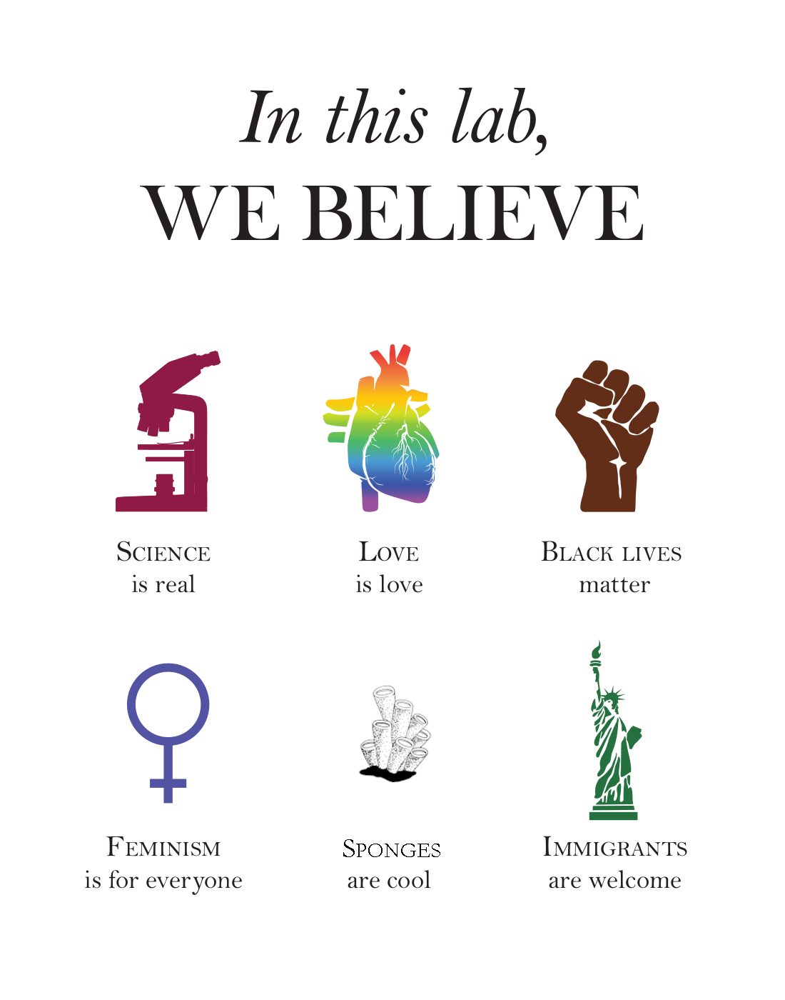

<style type="text/css">
h1.title {
  font-size: 52px;
  text-align: center;
}
body {
background-color: #daf8fe
}
</style>
<br>
<br>
<br>  

```{r our_beliefs, fig.align='center',echo=FALSE,out.width="50%"}

```

Thank you to <a href="https://sammykatta.com/diversity">Sammy Katta</a> for creating the original design for this poster. By using this poster we, as a lab, commit to  continuous allyship for marginalized and underrepresented communities. The full pledge can be found <a href="https://sammykatta.com/pledge">here</a>