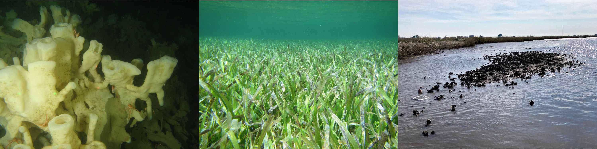

<style type="text/css">
h1.title {
  font-size: 52px;
  text-align: center;
}
body {
background-color: #B9F2FE
}
</style>
<br>

  
```{r banner image,fig.align='center',out.width="100%",echo=FALSE,out.extra='style="background-color: #00637a; padding:18px; display: inline-block;"'}

```  
<br>
<br> 
Welcome to the Archer Benthic Ecology Lab at Louisiana Universities Marine Consortium (<a href="https://lumcon.edu/">LUMCON</a>). We are a group of ecologists who spend our time exploring the fundamental principles that underpin the structure and function of biogenic habitats, or habitats formed by plants or animals. We use a combination of observational and experimental approaches to elucidate the role that habitat forming species play in maintaining biodiversity and ecosystem function in the Anthropocene.  
  
A key principle in our lab is that the findings of our research are applied. We aim to help tackle pressing issues in marine conservation. Consequently we work directly with fisheries and resource managers to identify habitats in need of protection and developing monitoring methods grounded in cutting edge research.  
  
With these goals in mind, our research is focused in three broad areas: 1) **revealing the factors that maintain biodiversity and ecosystem function**, 2) **identifying drivers of decline in biogenic habitats**, and 3) **developing monitoring and restoration techniques for biogenic habitats.**  

<br>
<br>
```{r,echo=FALSE,message=FALSE}
slickR::slickR(
    list.files("images/lab_slideshow/",full.names = TRUE,pattern = 'jpg'),
    height = 500)+slickR::settings(autoplay=TRUE,autoplaySpeed = 3500)
```